  
# Quem sou eu?

Chamo-me Emanuelli Carine, discente no estabelecimento de ensino IFRN - campus Ceará-Mirim, na turma 17015 - Técnico de Nível Médio em Programação de Jogos Digitais, na Forma Integrado (ano de ingresso 2015)

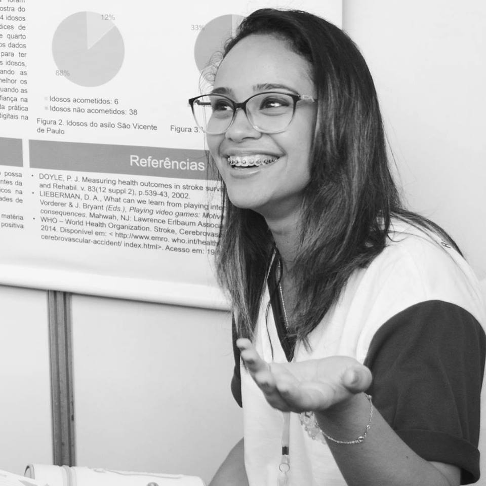

# Contatos:

* Email pessoal: emanuelli_carine@hotmail.com
* Email acadêmico: https://emanuelli.carine@academico.ifrn.edu.br
* Facebook: Emanuelli Carine

# Portifólio:

## Games

* Jogo com a temática cultura: Guerreiro da Floresta
[Jogo 1 oficina de criação : 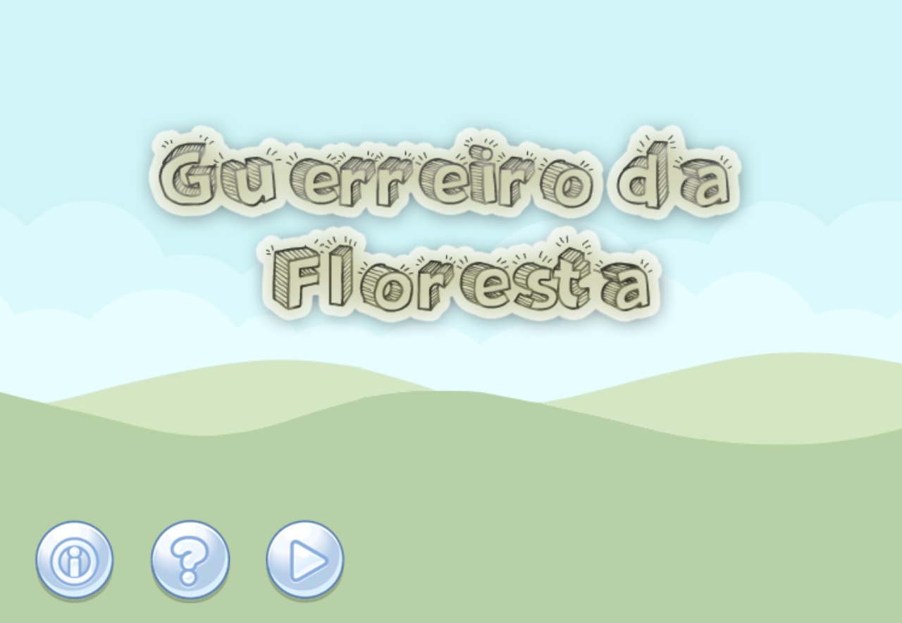](https://emanuellicarine.github.io/GuerreiroDaFloresta)
  
* Jogo com a temática mensagem: Cake Boss
[Jogo 2 oficina de criação : ](https://emanuellicarine.github.io/CakeBoss)
  
* Jogo com temática educacional: Jogando Limpo (serious game, voltado para o ensino infantil - em desenvolvimento)
[Jogo 3 Projeto de Pesquisa : Jogando Limpo 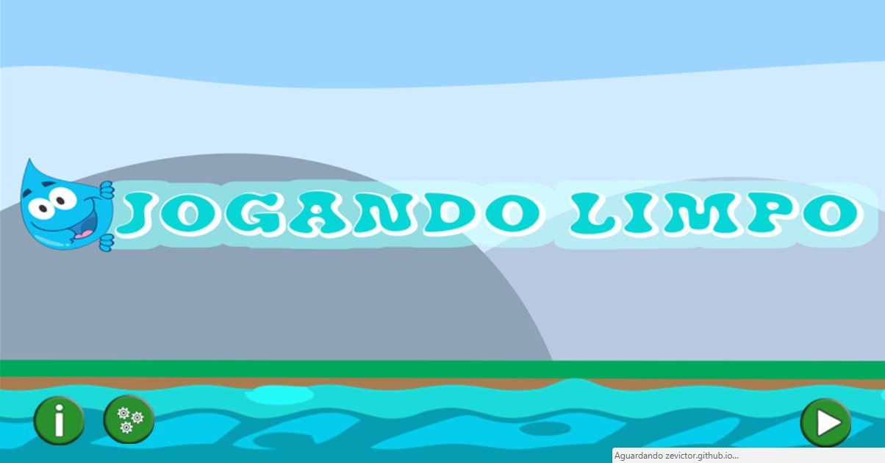](https://zevictor.github.io/ProjetoJogo)
  
* Jogo com a temática saúde: PROTECTING MY MOUTH (serious game, voltado para o público infantil - em desenvolvimento)
[Jogo 4 Projeto integrador : Protecting My Mouth 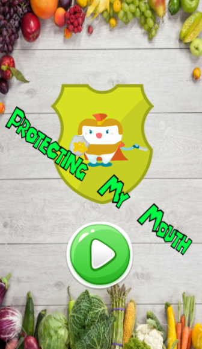](https://alex-alves.github.io/TD/)

## Arte

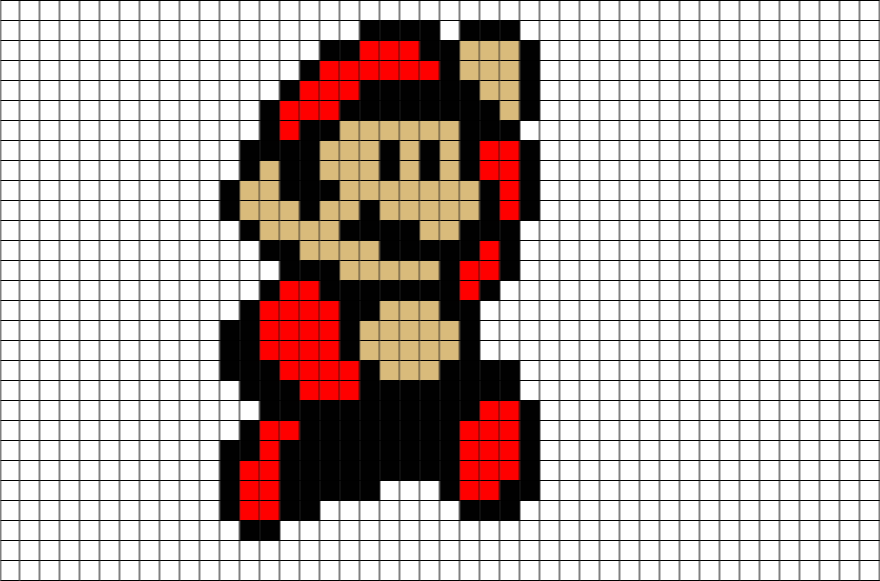

## Projetos

* MULHERES DE CEARÁ-MIRIM CRÍTICA LITERÁRIA AO ACERVO PRODUZIDO POR MULHERES DURANTE INÍCIO DO SÉCULO XX - 2015
  
* JOGANDO LIMPO COM O RIO CEARÁ-MIRIM - 2017/2018
  
* GAMETERAPIA: UMA FORMA DE UNIR JOGOS DIGITAIS A REABILITAÇÃO DE PACIENTES ACOMETIDOS PELO ACIDENTE VASCULAR ENCEFÁLICO (AVE) - 2017
  
* PROTECTING MY MOUTH: UMA FERRAMENTA LÚDICA PARA O AUXÍLIO E PREVENÇÃO À PATOLOGIAS BUCAIS - 2017/2018
  
* ESTUDO DE CASO: A GAMETERAPIA COMO UMA FERRAMENTA AUXILIAR NA REABILITAÇÃO DE IDOSOS COM A NEUROFUNCIONALIDADE COMPROMETIDAPELO ACIENTE VASCULAR ENCEFÁLICO (AVE) - 2017/2018

## Participações em eventos

* MOCITEC - ZN (2015), como finalista com o projeto de pesquisa sobre as Mulheres de Ceará-Mirim
  
* Semana do município de Ceará-Mirim (2016), como expositora do curso técnico em Programação de Jogos Digitais do campus IFRN, Ceará-Mirim, na modalidade poster
  
* II Semana do Meio Ambiente do Campus Ceará-Mirim (2017), como expositora da modalidade oral, com o projeto de pesquisa do Rio Ceará-Mirim
  
* II Samana do Meio Ambiente (2017), com o mini curso: Programando ideias sustentáveis
  
* FENECIT - PE (2017), como finalista com o projeto GAMETERAPIA
  
* EXPOTEC - APODI (2017), como expositora do projeto do Rio Ceará-Mirim
  
* EXPOTEC - APODI (2017), com o mini curso: Programando
  
* MOSTRATEC - RS  (2017), como finalista credenciada pela FENECIT
  
* EXPOTEC - CM  (2017), como expositora em apresentação oral com o projeto do Rio Ceará-Mirim e na modalidade poster com o projeto da GAMETERAPIA
  
* II semana de informática do campus Nova Cruz  (2018), como expositora na modalidade oral a cerca do curso de jogos dgitais e apresentação do projeto de pesquisa do Rio Ceará-Mirim

## Premiações

* Primeiro lugar na categoria ciências da saúde, com o projeto GAMETERAPIA: UMA FORMA DE UNIR JOGOS DIGITAIS A REABILITAÇÃO DE PACIENTES ACOMETIDOS PELO ACIDENTE VASCULAR ENCEFÁLICO (AVE) (FENECIT - PE, 2017)
  
* Credenciamento do projeto GAMETERAPIA: UMA FORMA DE UNIR JOGOS DIGITAIS A REABILITAÇÃO DE PACIENTES ACOMETIDOS PELO ACIDENTE VASCULAR ENCEFÁLICO (AVE) para a 32ª edição da mostratec, 2017 (Projeto credenciado na FENECIT - PE, 2017)
  
* Primeiro lugar na área da educação, com o projeto JOGANDO LIMPO COM O RIO CEARÁ-MIRIM (EXPOTEC Apodi, 2017)
  
* Credenciamento para a MOCICA 2018, no Ceará (MOCITEC - ZN, 2017)

## Registros fotograficos
  
  EXPOTEC - APODI (Apresentação em poster, prjeto "JOGANDO LIMPO COM O RIO CEARÁ-MIRIM)
  
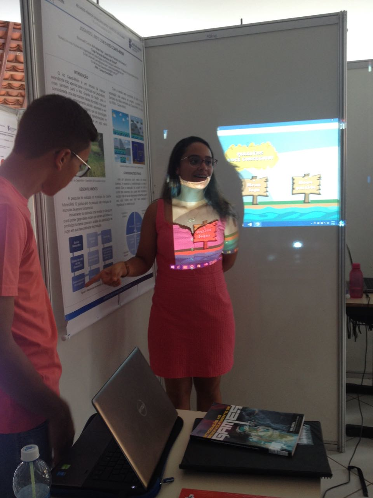
  Participantes: Emanuelli Carine e José Victor
  
  II SEMANA DE INFORMÁTICA DO AGRESTE POTIGUAR - CAMPUS NOVA CRUZ (Comunicação oral, apresentação do curso técnico em PJD)
    
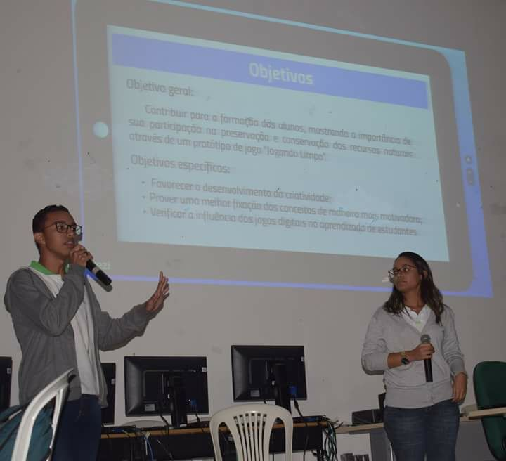
  Participantes: Emanuelli Carine e José Victor
  
  EXPOTEC - CEARÁ-MIRIM (Comunicação oral, projeto "JOGANDO LIMPO COM O RIO CEARÁ-MIRIM)
  
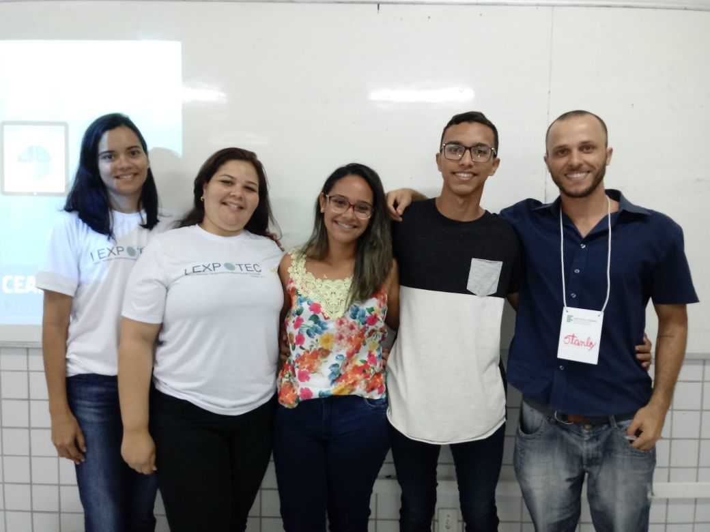
  Participantes: da esquerda para a direita: Cybelle Marques, Videanny Videnov, Emanuelli Carine, José Victor e Stanley Medeiros
    
   MOSTRATEC 2017 (RS, 2017 - apresentação em poster)
   
 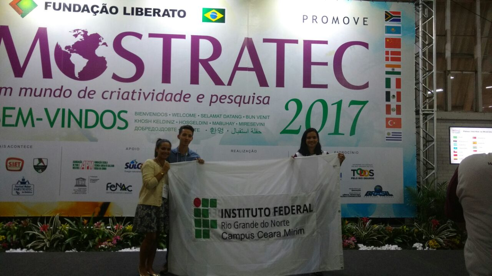
   Participantes: da esquerda para a direita: Emanuelli Carine, Videanny Videnov e Matheus Ricardo
    
   MOCITEC ZN (2015 - apresentação em poster)
   
 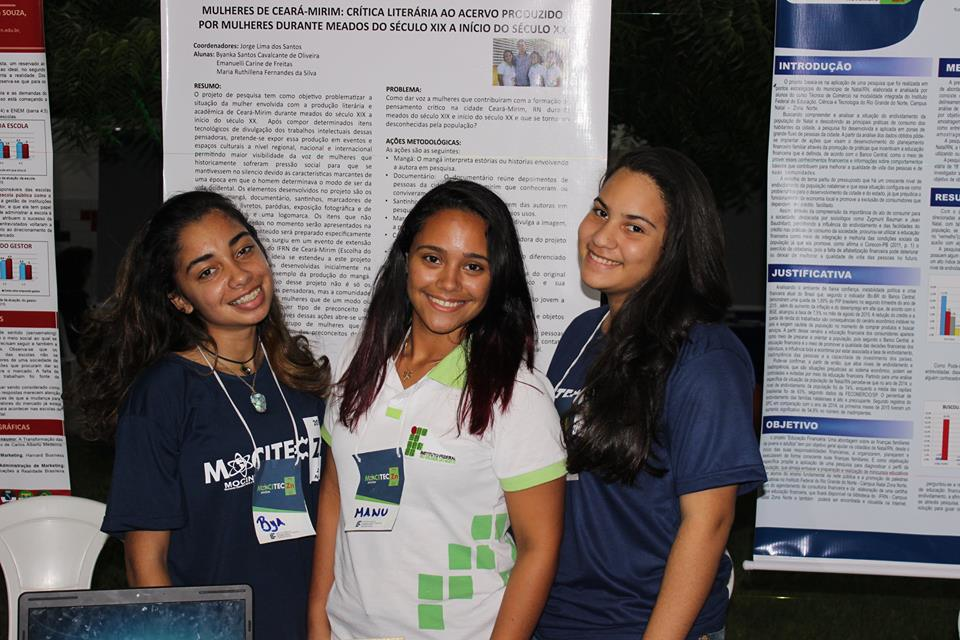
   Participantes: da esquerda para a direita: Maria Ruthillena, Emanuelli Carine e Byanka Cavalcanti
 
   FENECIT 13 (PE, 2017 - apresentação em poster)
   
 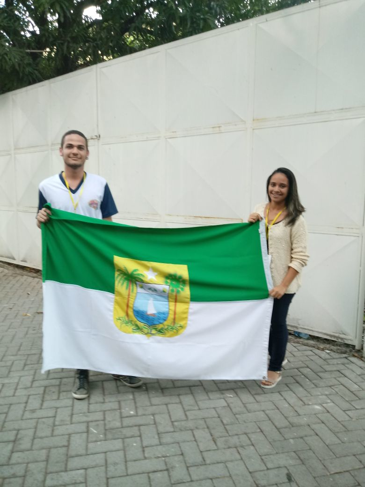
   Participantes: Emanuelli Carine e João Pedro
